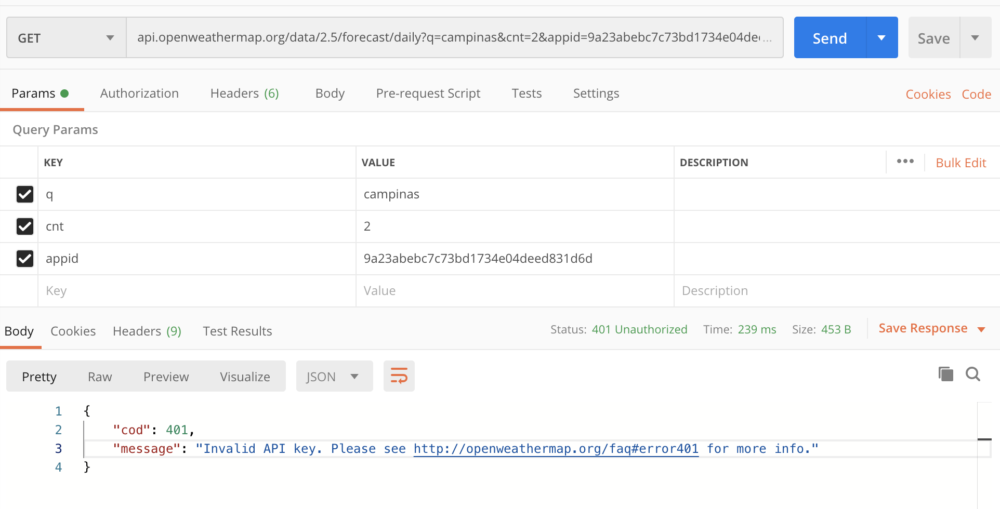

# Calendar Challenge

The code challenge made to schedule some reminders into the calendar.

## Getting started

To run the app, make sure that you have all the required tools installed [here](https://reactjs.org/docs/create-a-new-react-app.html)

First, clone this repository

```
$ git clone git@github.com:IgorMing/calendar-challenge.git
```

After that, let's navigate into it and install all the dependencies

```
$ yarn
# or
$ npm i
```

That's all! Now you can run the application

```
$ yarn start
```

## Mandatory Features

- [x] Ability to add a new "reminder" (max 30 chars) for a user entered day and time. Also, include a city.
- [x] Display reminders on the calendar view in the correct time order.
- [x] Allow the user to select color when creating a reminder and display it appropriately.
- [x] Ability to edit reminders – including changing text, city, day, time and color.
- [ ] Add a weather service call from a free API such as [​Open Weather Map​](https://openweathermap.org/forecast16), and get the
      weather forecast (ex. Rain) for the date of the calendar reminder based on the city.
- [ ] Unit test the functionality: ​Ability to add a new "reminder" (max 30 chars) for a user entered day and time. Also, include a city.

## Bonus (Optional)

- [x] Expand the calendar to support more than the current month.
- [x] Properly handle overflow when multiple reminders appear on the same date.
- [ ] Functionality to delete one or ALL the reminders for a specific day

## Extra Features

- [x] Add an extra list on the right side showing all the scheduled reminders, sorted by Date asc
- [x] All the reminders interaction _(get, add, edit, delete)_ are being saved into local storage. So you can reload the page and still keep seeing the data

> **Important note:** I wasn't able to implement the weather based on the filled city, because the API wasn't responding as expected. I received error 401, then, I tried to put the example request directly, which was also not succeeded (for CORS problems). I added an image below showing the error
> 
> If you wish, see the corresponding [URL](https://openweathermap.org/faq#error401) to check possible reasons for that failure.

I hope you liked it.

Thank you!
